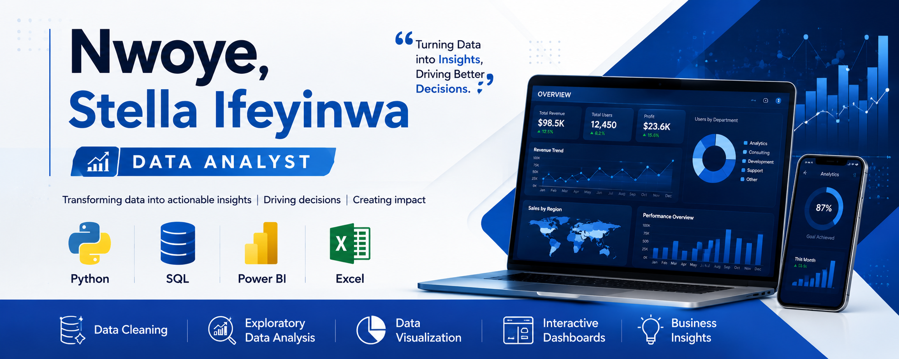

# Hi there 👋, I'm Nwoye, Stella Ifeyinwa 

## 💼 About Me

I am a Data Analyst passionate about transforming raw data into meaningful business insights that support data-driven decision-making.

## 🛠️ Technical Skills

- Microsoft Excel
- SQL
- Python (Pandas, NumPy, Matplotlib)
- Power BI
- Data Cleaning
- Data Visualization
- Exploratory Data Analysis (EDA)

## 📊 Featured Projects

- Employee Salary Analysis
- HR Analytics Dashboard
- Python Data Cleaning
- SQL Business Analysis
- Power BI Interactive Dashboards

## 🌱 Currently Learning

- Advanced Python
- Machine Learning
- Business Intelligence

## 🎯 Career Goal

To leverage data analytics to solve business problems and contribute to organizational growth through actionable insights.

## 📫 Connect With Me

- LinkedIn: (https://www.linkedin.com/in/stella-nwoye-b5725323a)
⭐ Thanks for visiting my GitHub profile!
